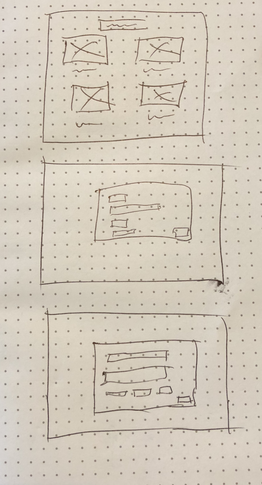
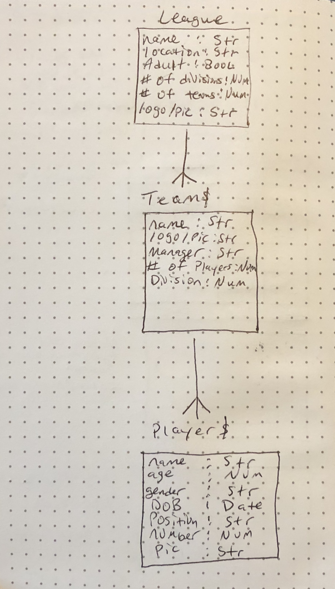

# League

## Overview

On the landing page users are shown a slideshow with a navbar directing them to leagues. Once in leagues they can select a league or create a new one. Once in league they can select a team or create a new one. Once in teams they can select a player a create a new one.

## Link to Site
https://evening-thicket-55641.herokuapp.com/

## Trello
https://trello.com/b/5iOd6Be8/league

## Wireframe

## ERD

## Technologies Used
Languages - HTML5, CSS3, Javascript, jQuery 
Frameworks: Bootstrap 
Project Planning & User Stories - Trello 
Visual Studio Code 

## Future Version
User will be able to sign up and sign in 
User will be able to have options to volunteer, sign up for camps and tournaments and find a trainer. 
